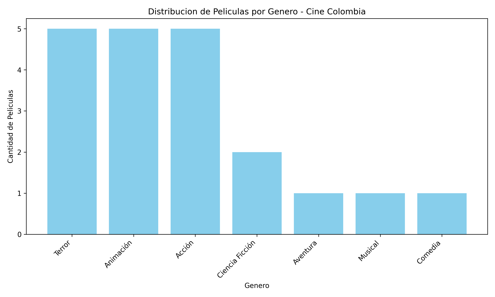
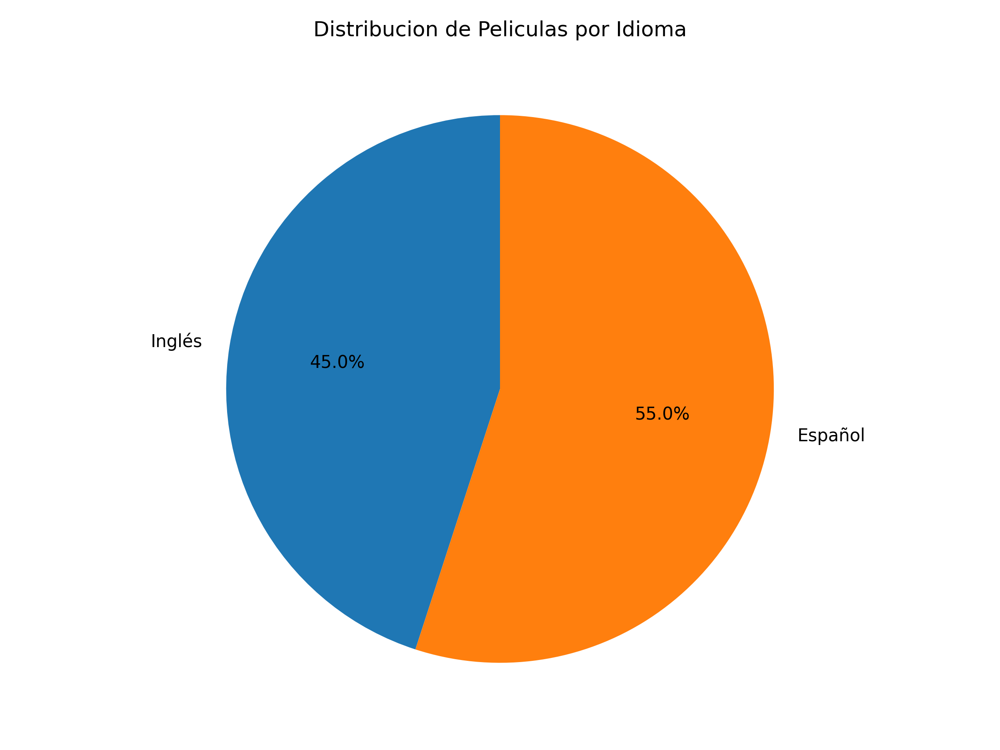

# Proyecto Análisis Big Data - Cine Colombia
## Apache PySpark + Python

### Descripción
Este proyecto implementa un análisis Big Data sobre películas en cartelera de Cine Colombia utilizando Apache PySpark para procesamiento distribuido y escalable.

### 🛠️ Tecnologías Utilizadas
- **Apache PySpark**: Framework de procesamiento distribuido
- **Python**: Lenguaje de programación
- **Pandas**: Manipulación de datos para visualización
- **Matplotlib**: Generación de gráficos estadísticos

### Estructura del Proyecto
```
Proyecto_PySpark/
│
├── peliculas.csv          # Dataset con 20 películas
├── analisis.py            # Script principal de análisis
├── resultados/            # Resultados y gráficos generados
│   ├── peliculas_por_genero.png
│   ├── peliculas_por_idioma.png
│   └── analisis_genero/
└── README.md
```

### Dataset
El archivo `peliculas.csv` contiene 20 películas con los siguientes campos:
- **titulo**: Nombre de la película
- **genero**: Categoría (Terror, Acción, Animación, etc.)
- **duracion**: Duración en minutos
- **clasificacion**: Clasificación por edad
- **idioma**: Idioma disponible
- **director**: Director de la película
- **actor**: Actor principal
- **pais**: País de origen
- **anio**: Año de producción

### Instalación

#### 1. Instalar dependencias
```bash
pip install pyspark pandas matplotlib
```

#### 2. Verificar instalación de Java
PySpark requiere Java 8 o superior:
```bash
java -version
```

#### 3. Ejecutar el análisis
```bash
python analisis.py
```

### Análisis Implementados

#### Análisis 1: Distribución por Género
```python
df.groupBy("genero").count().orderBy(desc("count"))
```
Agrupa películas por género y cuenta cuántas hay de cada tipo.

#### Análisis 2: Duración Promedio
```python
df.select(avg("duracion").alias("duracion_promedio"))
```
Calcula la duración promedio de todas las películas.

#### Análisis 3: Películas Largas
```python
df.filter(col("duracion") > 120)
```
Filtra películas con duración mayor a 120 minutos.

#### Análisis 4-10: Análisis Adicionales
- Distribución por idioma
- Distribución por clasificación
- Directores más prolíficos
- Películas por país
- Estadísticas de duración
- Análisis específico de terror
- Películas en español

### Componentes Clave de PySpark

#### SparkSession
```python
spark = SparkSession.builder \
    .appName("Peliculas Cine Colombia") \
    .master("local[*]") \
    .getOrCreate()
```
**Función**: Inicializa el entorno de Spark y crea el punto de entrada para todas las operaciones.
- `appName`: Nombre de la aplicación
- `master("local[*]")`: Ejecuta en modo local usando todos los cores disponibles
- `getOrCreate()`: Obtiene sesión existente o crea una nueva

#### DataFrame
```python
df = spark.read.csv("peliculas.csv", header=True, inferSchema=True)
```
**Función**: Estructura de datos distribuida e inmutable organizada en columnas.
- Procesamiento paralelo automático
- Optimización de consultas con Catalyst Optimizer
- Lazy evaluation para mejor rendimiento
- API similar a SQL y Pandas

#### groupBy()
```python
df.groupBy("genero").count()
```
**Función**: Agrupa datos por una o más columnas y aplica funciones de agregación.
- Procesamiento distribuido en múltiples nodos
- Operación paralela eficiente
- Reduce shuffle de datos

#### filter()
```python
df.filter(col("duracion") > 120)
```
**Función**: Filtra registros basándose en condiciones.
- Evaluación perezosa (lazy evaluation)
- Optimización automática de predicados
- No carga datos innecesarios en memoria

#### Funciones de Agregación
```python
from pyspark.sql.functions import avg, count, sum
df.select(avg("duracion"))
```
**Función**: Operaciones matemáticas distribuidas sobre columnas.
- Cálculos paralelos
- Optimización automática
- Manejo eficiente de grandes volúmenes

### Resultados Esperados

```
============================================================
ANÁLISIS BIG DATA - PELÍCULAS CINE COLOMBIA
Usando Apache PySpark
============================================================

[1] Cargando datos desde CSV...
✓ Total de películas cargadas: 20

============================================================
ANÁLISIS 1: Distribución de películas por género
============================================================
+------------------+-----+
|genero            |count|
+------------------+-----+
|Terror            |5    |
|Acción            |4    |
|Animación         |4    |
|Ciencia Ficción   |2    |
...
```

### Ventajas de PySpark sobre Python Tradicional

#### Python Tradicional
```python
# Procesamiento secuencial
total = 0
for pelicula in peliculas:
    if pelicula['duracion'] > 120:
        total += 1
```
- ❌ Procesamiento secuencial (una por una)
- ❌ Limitado por memoria RAM
- ❌ No escalable a grandes volúmenes
- ❌ Sin optimización automática

#### PySpark
```python
# Procesamiento distribuido
df.filter(col("duracion") > 120).count()
```
- ✅ Procesamiento paralelo en múltiples cores/nodos
- ✅ Manejo de datos que exceden la memoria RAM
- ✅ Escalable horizontalmente (agregar más máquinas)
- ✅ Optimización automática de consultas (Catalyst)
- ✅ Lazy evaluation para mejor rendimiento
- ✅ Tolerancia a fallos automática

### Visualizaciones Generadas

#### 1. Gráfico de Barras - Películas por Género


#### 2. Gráfico Circular - Películas por Idioma


### Conceptos Clave de Big Data

#### Procesamiento Distribuido
Los datos se dividen en particiones y se procesan en paralelo en múltiples nodos.

#### Lazy Evaluation
Las transformaciones no se ejecutan inmediatamente, sino que se optimizan y ejecutan cuando se requiere una acción.

#### Catalyst Optimizer
Motor de optimización que analiza y mejora automáticamente las consultas antes de ejecutarlas.

#### Shuffle
Redistribución de datos entre particiones necesaria para operaciones como `groupBy()`.

### Análisis Académico

#### ¿Por qué PySpark?
1. **Escalabilidad**: Procesa desde MB hasta PB de datos
2. **Velocidad**: Procesamiento en memoria hasta 100x más rápido que MapReduce
3. **Facilidad**: API de alto nivel similar a Pandas
4. **Integración**: Compatible con Hadoop, Hive, Cassandra, etc.
5. **Versatilidad**: Soporta SQL, streaming, ML y grafos

#### Casos de Uso Real
- Netflix: Recomendaciones de películas
- Uber: Análisis de rutas y precios
- Spotify: Análisis de preferencias musicales
- Amazon: Análisis de comportamiento de compra

### Conclusiones

Este proyecto demuestra:
✅ Implementación de procesamiento Big Data con PySpark
✅ Transformaciones distribuidas sobre datasets
✅ Análisis estadístico escalable
✅ Generación de visualizaciones
✅ Ventajas sobre procesamiento tradicional
✅ Aplicación práctica en dominio de entretenimiento

### Integración con Proyecto Jena

Este proyecto complementa el proyecto de Base de Datos Semántica (Apache Jena) creando un **ecosistema completo**:

- **Jena (Web Semántica)**: Modelado semántico y consultas SPARQL
- **PySpark (Big Data)**: Análisis estadístico y procesamiento distribuido

Ambos trabajan sobre el mismo dominio: **Películas de Cine Colombia**

### Autor
Proyecto académico - Análisis Big Data
Cine Colombia - 2026
